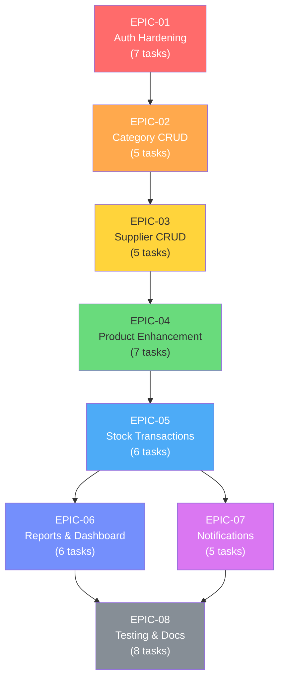

# 📋 Inventory Management — Micro Tasks Breakdown

> Setiap task dirancang agar bisa diselesaikan dalam **≤ 15 menit**.
> Kerjakan **sesuai urutan**, karena banyak task yang saling bergantung.

---

## Legend

| Symbol | Meaning |
|--------|---------|
| 🟢 | Independent — bisa langsung dikerjakan |
| 🔵 | Depends on task sebelumnya di EPIC yang sama |
| 🔴 | Depends on EPIC lain (cross-dependency) |
| `[NEW]` | Buat file baru |
| `[EDIT]` | Edit file existing |

---

## Phase 1 — Foundation

### EPIC-01: Auth Hardening (8 tasks)

| # | Task | File | Est. | Dep |
|---|------|------|------|-----|
| 1.1 | **Tambah field `role` di User model** — Tambahkan `role String @default("STAFF")` dan `stockTransactions StockTransaction[]` di model User. Jalankan `npx prisma migrate dev --name add-user-role` | `[EDIT]` prisma/schema.prisma | 5m | 🟢 |
| 1.2 | **Buat type declaration untuk Express Request** — Extend `Request` interface dengan property `user` (`{ id: number; role: string }`) | `[NEW]` src/types/express.d.ts | 5m | 🟢 |
| 1.3 | **Update UserService: bcrypt hash + findById** — Import `bcryptjs`, hash password di method `create()`, tambah method `findById()`, tambah method `comparePassword()` | `[EDIT]` src/services/user.service.ts | 10m | 🔵 1.1 |
| 1.4 | **Fix AuthController: bcrypt compare** — Ganti plain-text password check dengan `bcrypt.compare()`. Pastikan register juga memanggil service yang sudah hash | `[EDIT]` src/controllers/auth.controller.ts | 10m | 🔵 1.3 |
| 1.5 | **Buat Auth Middleware (JWT protect)** — Extract `Bearer` token dari header, `verifyToken()`, attach `req.user`, throw `UnauthorizedError` jika gagal | `[NEW]` src/middlewares/auth.middleware.ts | 10m | 🔵 1.2 |
| 1.6 | **Buat Role Middleware** — Function `authorize(...roles: string[])` yang check `req.user.role`, throw `ForbiddenError` jika tidak match | `[NEW]` src/middlewares/role.middleware.ts | 5m | 🔵 1.5 |
| 1.7 | **Buat ADMIN Seeder** — Buat file seed untuk generate default user admin `admin@example.com`, konfigurasi `package.json` untuk prisma seed | `[NEW]` prisma/seed.ts | 5m | 🔵 1.1 |
| 1.8 | **Wire auth routes + protect endpoints** — Tambah `POST /auth/register`, `GET /auth/me`. Pasang `authenticate` middleware di semua route kecuali login/register. Tambah `loginSchema` validation | `[EDIT]` src/routes/api.ts, `[EDIT]` src/schemas/user.schema.ts | 10m | 🔵 1.6 |

> [!TIP]
> **Test setelah EPIC-01 selesai:** Register user baru → Login → Gunakan token di header `Authorization: Bearer <token>` → Hit protected route.

---

### EPIC-02: Category CRUD (5 tasks)

| # | Task | File | Est. | Dep |
|---|------|------|------|-----|
| 2.1 | **Update Category model di Prisma** — Tambah `description String?`, `@unique` pada `name`, tambah `products Product[]` relation. Jalankan `npx prisma migrate dev --name update-category` | `[EDIT]` prisma/schema.prisma | 5m | 🔴 1.1 |
| 2.2 | **Buat Category Zod Schema** — `createCategorySchema` (name required min 2, description optional), `updateCategorySchema` (partial) | `[NEW]` src/schemas/category.schema.ts | 5m | 🟢 |
| 2.3 | **Buat CategoryService** — Class dengan method `getAll()` (include `_count.products`), `getById()`, `create()`, `update()`, `delete()` (check products count sebelum delete, throw error jika > 0) | `[NEW]` src/services/category.service.ts | 12m | 🔵 2.1 |
| 2.4 | **Buat CategoryController** — `index`, `show`, `store`, `update`, `destroy` menggunakan pattern yang sama dengan ProductController (asyncHandler, withLocalTime) | `[NEW]` src/controllers/category.controller.ts | 10m | 🔵 2.3 |
| ~~2.5~~ | ✅ **Register category routes** — Terdaftar di `api.ts` dengan role guard ADMIN untuk write operations. | `[EDIT]` src/routes/api.ts | 5m | 🔵 2.4 |

> [!TIP]
> **Test:** Buat beberapa category → Coba delete category kosong (sukses) → Coba delete category yang punya product (gagal 403).

---

## Phase 2 — Core Inventory

### EPIC-03: Supplier CRUD (5 tasks)

> [!NOTE]
> Supplier dikerjakan **sebelum** Product Enhancement karena Product akan butuh `supplierId`.

| # | Task | File | Est. | Dep |
|---|------|------|------|-----|
| 3.1 | **Tambah Supplier model di Prisma** — name, email?, phone?, address?, relasi ke Product[] dan StockTransaction[]. Jalankan `npx prisma migrate dev --name add-supplier` | `[EDIT]` prisma/schema.prisma | 5m | 🔴 2.1 |
| 3.2 | **Buat Supplier Zod Schema** — `createSupplierSchema` (name required, email/phone/address optional), `updateSupplierSchema` | `[NEW]` src/schemas/supplier.schema.ts | 5m | 🟢 |
| 3.3 | **Buat SupplierService** — `getAll()` (include `_count.products`), `getById()`, `create()`, `update()`, `delete()` (guard jika ada product linked) | `[NEW]` src/services/supplier.service.ts | 12m | 🔵 3.1 |
| 3.4 | **Buat SupplierController** — `index`, `show`, `store`, `update`, `destroy` (ikuti pattern existing) | `[NEW]` src/controllers/supplier.controller.ts | 10m | 🔵 3.3 |
| 3.5 | **Register supplier routes** — `GET/POST /suppliers`, `GET/PUT/DELETE /suppliers/:id` dengan auth + role guard | `[EDIT]` src/routes/api.ts | 5m | 🔵 3.4 |

---

### EPIC-04: Product Enhancement (7 tasks)

| # | Task | File | Est. | Dep |
|---|------|------|------|-----|
| 4.1 | **Update Product model di Prisma** — Tambah `sku @unique`, `description?`, `minStock @default(10)`, `imageUrl?`, `categoryId`, `supplierId?`, relasi ke Category & Supplier. Jalankan migration | `[EDIT]` prisma/schema.prisma | 10m | 🔴 3.1 |
| 4.2 | **Buat SKU Generator utility** — Function `generateSku(categoryName: string, sequenceNumber: number): string` → Output: `ELC-001`, `FND-002`. Ambil 3 huruf pertama uppercase dari category name | `[NEW]` src/utils/sku.util.ts | 8m | 🟢 |
| 4.3 | **Buat Pagination utility** — Function `paginate(page, limit)` → return `{ skip, take }`. Function `paginationMeta(total, page, limit)` → return `{ currentPage, lastPage, perPage, total }` | `[NEW]` src/utils/pagination.util.ts | 8m | 🟢 |
| 4.4 | **Update Product Zod Schema** — Tambah field `description?`, `minStock?`, `imageUrl?`, `categoryId` (required, positive int), `supplierId?` | `[EDIT]` src/schemas/product.schema.ts | 8m | 🟢 |
| 4.5 | **Update ProductService — create & update** — Auto-generate SKU via `generateSku()`. Include `category` dan `supplier` relation di semua queries. Update method signatures | `[EDIT]` src/services/product.service.ts | 12m | 🔵 4.1, 4.2 |
| 4.6 | **Update ProductService — getAll with filter & pagination** — Support query params: `search` (name LIKE), `categoryId`, `page`, `limit`. Return data + pagination meta | `[EDIT]` src/services/product.service.ts | 12m | 🔵 4.3, 4.5 |
| 4.7 | **Update ProductController** — Parse query params, pass ke service, return response dengan pagination meta | `[EDIT]` src/controllers/product.controller.ts | 10m | 🔵 4.6 |

---

## Phase 3 — Stock System

### EPIC-05: Stock Transactions (6 tasks)

| # | Task | File | Est. | Dep |
|---|------|------|------|-----|
| 5.1 | **Tambah StockTransaction model di Prisma** — productId, supplierId?, userId, type (IN/OUT), reason, quantity, notes?, createdAt. Jalankan migration | `[EDIT]` prisma/schema.prisma | 8m | 🔴 4.1 |
| 5.2 | **Buat StockTransaction Zod Schema** — `stockInSchema` (productId, supplierId?, quantity, reason enum [PURCHASE, RETURN, ADJUSTMENT], notes?), `stockOutSchema` (reason enum [SALE, DAMAGE, ADJUSTMENT]) | `[NEW]` src/schemas/stock-transaction.schema.ts | 8m | 🟢 |
| 5.3 | **Buat StockTransactionService — stockIn** — Gunakan `prisma.$transaction()`: create StockTransaction + increment `product.stock`. Return transaction with product detail | `[NEW]` src/services/stock-transaction.service.ts | 12m | 🔵 5.1 |
| 5.4 | **StockTransactionService — stockOut** — Gunakan `prisma.$transaction()`: validate stock cukup (throw `ValidationError` jika insufficient), create transaction + decrement `product.stock` | `[EDIT]` src/services/stock-transaction.service.ts | 12m | 🔵 5.3 |
| 5.5 | **StockTransactionService — getHistory** — Filter by `productId?`, `type?`, `startDate?`, `endDate?`. Include product & user relation. Support pagination | `[EDIT]` src/services/stock-transaction.service.ts | 10m | 🔵 5.4 |
| 5.6 | **Buat StockTransactionController + register routes** — `stockIn`, `stockOut`, `history`, `show`. Register di routes: `POST /stock/in`, `POST /stock/out`, `GET /stock/transactions`, `GET /stock/transactions/:id` | `[NEW]` src/controllers/stock-transaction.controller.ts, `[EDIT]` src/routes/api.ts | 12m | 🔵 5.5 |

> [!IMPORTANT]
> **Atomicity is critical!** Selalu gunakan `prisma.$transaction()` untuk stock in/out agar data tidak inkonsisten jika terjadi error di tengah proses.

---

### EPIC-06: Reports & Dashboard (6 tasks)

| # | Task | File | Est. | Dep |
|---|------|------|------|-----|
| 6.1 | **Buat ReportService — getDashboard** — Aggregate query: `totalProducts`, `totalCategories`, `totalSuppliers`, `totalStockValue` (SUM price*stock), `lowStockProducts` count | `[NEW]` src/services/report.service.ts | 12m | 🔴 5.1 |
| 6.2 | **ReportService — getLowStock** — Query products dimana `stock <= minStock`, include category. Support pagination | `[EDIT]` src/services/report.service.ts | 8m | 🔵 6.1 |
| 6.3 | **ReportService — getStockByCategory** — Group products by category, aggregate `totalStock` dan `totalValue` per category | `[EDIT]` src/services/report.service.ts | 10m | 🔵 6.1 |
| 6.4 | **Buat Excel Export utility** — Helper function menggunakan `exceljs`: `exportToExcel(columns, data, sheetName)` → return Buffer | `[NEW]` src/utils/excel.util.ts | 12m | 🟢 |
| 6.5 | **ReportService — exportStockExcel & exportTransactionExcel** — Format data dari DB → pass ke `exportToExcel()` → return Buffer | `[EDIT]` src/services/report.service.ts | 12m | 🔵 6.4 |
| 6.6 | **Buat ReportController + register routes** — `dashboard`, `lowStock`, `exportStock`, `exportTransactions`. Set response header `Content-Type: application/vnd.openxmlformats...` untuk Excel. Register routes | `[NEW]` src/controllers/report.controller.ts, `[EDIT]` src/routes/api.ts | 12m | 🔵 6.5 |

---

## Phase 4 — Polish

### EPIC-07: Notifications / BullMQ (5 tasks)

| # | Task | File | Est. | Dep |
|---|------|------|------|-----|
| 7.1 | **Setup Redis connection + BullMQ queue** — Create queue instance `lowStockQueue`, configure Redis connection (dari .env: `REDIS_HOST`, `REDIS_PORT`) | `[NEW]` src/lib/queue.ts | 10m | 🟢 |
| 7.2 | **Buat NotificationService** — Setup nodemailer transporter (dari .env), method `sendLowStockAlert(product, currentStock)` → kirim email ke admin | `[NEW]` src/services/notification.service.ts | 10m | 🟢 |
| 7.3 | **Buat Low Stock Alert Job** — BullMQ Worker yang listen `lowStockQueue`, process job → panggil `notificationService.sendLowStockAlert()` | `[NEW]` src/jobs/low-stock-alert.job.ts | 10m | 🔵 7.1, 7.2 |
| 7.4 | **Integrate alert ke StockTransactionService** — Setelah `stockOut`, check if `product.stock <= product.minStock` → dispatch job ke `lowStockQueue` | `[EDIT]` src/services/stock-transaction.service.ts | 8m | 🔵 7.3, 🔴 5.4 |
| 7.5 | **Tambah env variables + update .env.example** — `REDIS_HOST`, `REDIS_PORT`, `SMTP_HOST`, `SMTP_PORT`, `SMTP_USER`, `SMTP_PASS`, `ALERT_EMAIL_TO` | `[EDIT]` .env.example | 3m | 🟢 |

> [!WARNING]
> **Prerequisite:** Redis harus sudah running. Install via `brew install redis && brew services start redis` atau gunakan Docker: `docker run -d -p 6379:6379 redis`

---

### EPIC-08: Testing & Docs (8 tasks)

| # | Task | File | Est. | Dep |
|---|------|------|------|-----|
| 8.1 | **Setup test database helpers** — Create/reset test DB, seed helper functions, global setup/teardown untuk Jest | `[NEW]` src/__tests__/utils/setup.ts | 12m | 🟢 |
| 8.2 | **Integration test: Auth** — Test register (success + duplicate email), login (success + wrong password), protected route tanpa token | `[NEW]` src/__tests__/integration/auth.test.ts | 15m | 🔵 8.1 |
| 8.3 | **Integration test: Category CRUD** — Test create, list (with _count), update, delete (empty + with products) | `[NEW]` src/__tests__/integration/category.test.ts | 15m | 🔵 8.1 |
| 8.4 | **Integration test: Supplier CRUD** — Test create, list, update, delete (linked + unlinked) | `[NEW]` src/__tests__/integration/supplier.test.ts | 15m | 🔵 8.1 |
| 8.5 | **Integration test: Product CRUD** — Test create (with SKU auto-gen), list (pagination, filter), update, delete | `[NEW]` src/__tests__/integration/product.test.ts | 15m | 🔵 8.1 |
| 8.6 | **Integration test: Stock Transactions** — Test stock in, stock out (success + insufficient stock), transaction history with filters | `[NEW]` src/__tests__/integration/stock-transaction.test.ts | 15m | 🔵 8.1 |
| 8.7 | **Update api-test.http** — Tambah semua endpoint baru (Category, Supplier, Stock In/Out, Reports) ke file REST Client | `[EDIT]` api-test.http | 10m | 🔴 All EPICs |
| 8.8 | **Update README.md** — Project overview, setup instructions, environment variables, API endpoint summary, tech stack | `[EDIT]` README.md | 15m | 🔴 All EPICs |

---

## 📊 Summary

| Phase | EPIC | Tasks | Total Est. Time |
|-------|------|-------|-----------------|
| 1 | EPIC-01: Auth Hardening | 7 tasks | ~55 min |
| 1 | EPIC-02: Category CRUD | 5 tasks | ~37 min |
| 2 | EPIC-03: Supplier CRUD | 5 tasks | ~37 min |
| 2 | EPIC-04: Product Enhancement | 7 tasks | ~68 min |
| 3 | EPIC-05: Stock Transactions | 6 tasks | ~62 min |
| 3 | EPIC-06: Reports & Dashboard | 6 tasks | ~66 min |
| 4 | EPIC-07: Notifications (BullMQ) | 5 tasks | ~41 min |
| 4 | EPIC-08: Testing & Docs | 8 tasks | ~112 min |
| **Total** | | **49 tasks** | **~478 min (~8 jam)** |

---

## 🗺️ Dependency Graph

---

> [!TIP]
> **Cara paling efektif:** Kerjakan satu task → test manual via `api-test.http` → commit → lanjut task berikutnya. Jangan skip testing di antara task!.
